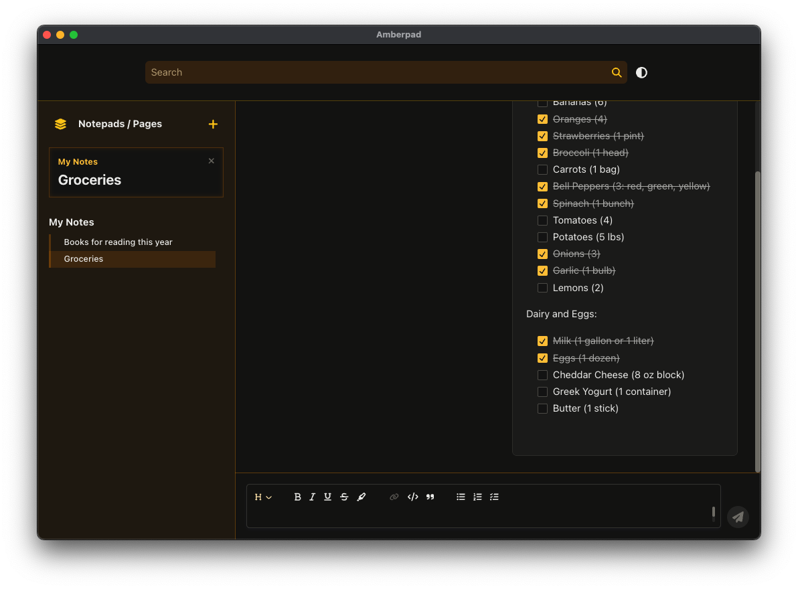

# Amberpad - Desktop

Simple, efficient, and smart. The note-taking app with a web chat aesthetic.

## About

Amberpad is a free, open-source, cross-platform note-taking app built with [Node.js](https://nodejs.org/), [Electron](https://www.electronjs.org/), [React](https://react.dev/), and [TypeScript](https://www.typescriptlang.org/). Amberpad is designed to be simple, usable, secure, and accessible—everything a note-taking app should be.

## Versions

Amberpad is currently in Beta development. If you encounter any issues with the app, please report them in the [issues](#) section of this repository. Any help to improve the app is greatly appreciated.

## Contributing

We welcome contributions! Please refer to our [contributing guidelines](CONTRIBUTING.md) for more information on how to get involved.

## Versions
Amberpad is a project still in development, currently in Beta version, any issue with the app can be reported in the [issues]() section of this repository, any help to improve the app is appreciated.
