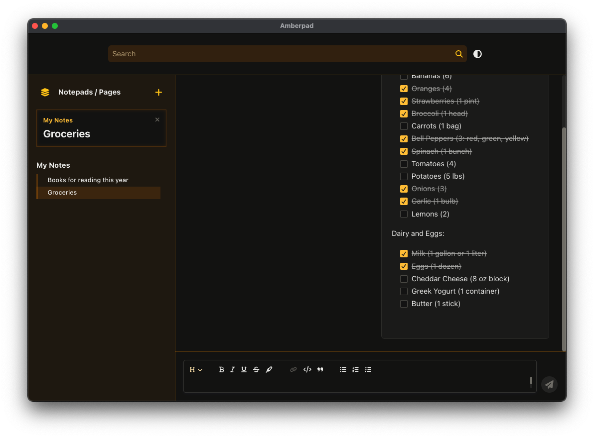

# Amberpad - Desktop - Electron

Simple, efficient, and smart. The note-taking app with a web chat aesthetic.

## About

Amberpad is a free, open-source, cross-platform note-taking app built with [Node.js](https://nodejs.org/), [Electron](https://www.electronjs.org/), [React](https://react.dev/), and [TypeScript](https://www.typescriptlang.org/). Amberpad is designed to be simple, usable, secure, and accessible—everything a note-taking app should be.

## Versions

This repository's project is currently considered only a demo version for Electron. A decision has been made to move the project to Tauri, which is easier to maintain for a small group of developers.

The current version of the demo is already a functional app in beta state, so I will keep it in this repository as a demo to show the idea and capabilities behind the design of the app.